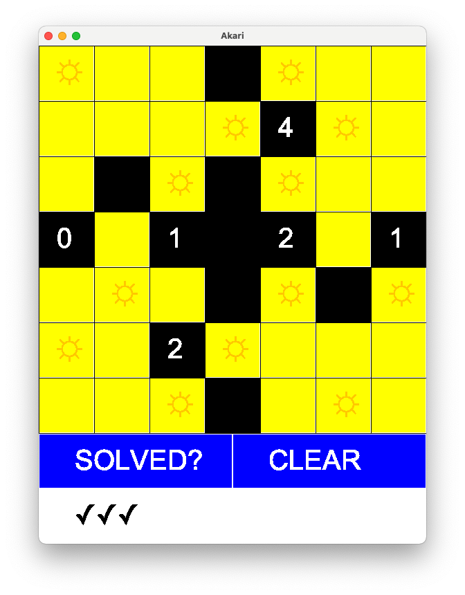
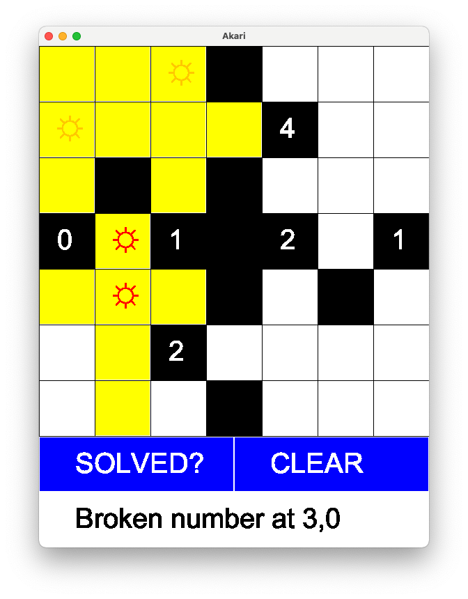

# Akari

This is a uni project for Java Unit, the requriement is to create a game - Akari. Watch it on[ Youtube](https://youtu.be/Xy9lOy2HI88).

Akari is also known as Light Up, a puzzle game. [Light Up (puzzle) - Wikipedia](<https://en.wikipedia.org/wiki/Light_Up_(puzzle)>)

This is a project for java unit. We demonstrated our skills of Jave including read files, useage of 2D arrays, setting up mouseclick actions and rendering the interface, etc.

## Screenshot

### Solved

### Warning

